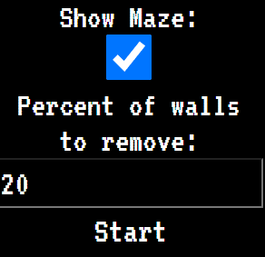

# 🏹 Gymnasiearbete-Maze-Gen-Solve

Gymnasiearbete is a project done at the end of gymnasiet (equvialent to last 3 years of high school) that is necessary for graduation. I chose make my own implementation of A* that finds the shortest path through a maze that is generated by a backtracking algorithm. The user can input a percentage of walls that to remove after generation so that there will be multiple paths through it. A lot of it was based on projects made by [Coding Train on YouTube.](https://www.youtube.com/c/TheCodingTrain).

Don't judge it too hard, I was very much a beginner at the time. 

---

  

---
### 🛠️ Features:
In this reposiory:

  
  
  - 🎓 Successfully let me graduat
  - 👁️ Shows all attempted steps
  - 📍 Maze generation
  - 🗺️ A* path finding
  - ✨ 2 generation display modes
  - 💨 Percentage wall removal
  - 🤯 Pausing
  - 🔄 Reset button
  
Missing (files weren't from the finished project):
  - ❓  Probably forgotten something

### 👁️ Looking back
I notice that I've learnt a lot about code structure, best practices, writing good/clean code, some features or techniques I wasn't aware of and conventional formatting. There's definetly a lot I would do different if I wrote it today.

The step taken and the calculation for every frame is done on that frame which means that it can feel somewhat slow. The calculations should have been done in the background or before displaying so that 
